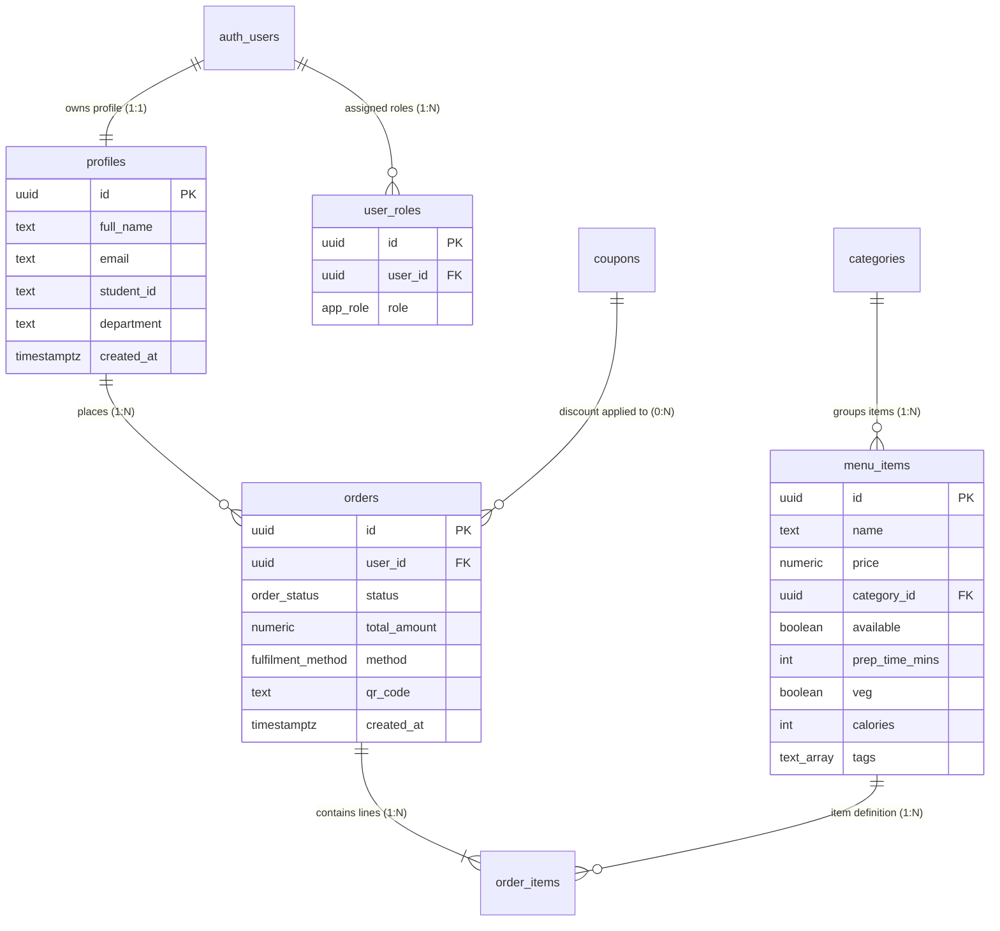

<div align="center">

# ⚡ CANTEENOS KITCHEN HUB ⚡
### *The Ultimate Smart Canteen, Kitchen Operations & Student Fitness Platform*

```text
  ██████╗░█████╗░███╗░░██╗████████╗███████╗███████╗███╗░░██╗░█████╗░███████╗
  ██╔════╝██╔══██╗████╗░██║╚══██╔══╝██╔════╝██╔════╝████╗░██║██╔══██╗██╔════╝
  ██║░░░░░███████║██╔██╗██║░░░██║░░░█████╗░░█████╗░░██╔██╗██║██║░░██║███████╗
  ██║░░░░░██╔══██║██║╚████║░░░██║░░░██╔══╝░░██╔══╝░░██║╚████║██║░░██║╚════██║
  ╚██████╗██║░░██║██║░╚███║░░░██║░░░███████╗███████╗██║░╚███║╚█████╔╝███████║
  ░╚═════╝╚═╝░░╚═╝╚═╝░░╚══╝░░░╚═╝░░░╚══════╝╚══════╝╚═╝░░╚══╝░╚════╝░╚══════╝
```

**Order Ahead • Skip the Queue • Live Kitchen Kanban • Voice Ordering 🎙️ • Student Fitness & Protein Companion 🥩 • Dynamic QR Pickup**

[](https://www.linkedin.com/in/ranjit-patra-b27816393)
[](https://github.com/Ranjitpatra26/canteenos-hub.git)
[](https://www.typescriptlang.org/)
[](https://react.dev/)
[](https://supabase.com/)
[](https://tailwindcss.com/)
[](#-on-device--grok-canteen-ai-engine)
[](LICENSE)

[🌟 Plain-English Overview](#-plain-english-executive-overview) · [👥 User Role Guides](#-quick-start-by-user-role) · [🎙️ Voice Ordering](#-voice-command-ordering--ai-features) · [🥩 Student Fitness Companion](#-student-fitness-protein--gym-companion) · [🏗️ System Topology](#-system-topology--event-driven-architecture) · [📊 Database ERD](#-database-schema--entity-relationship-diagram-erd) · [⚡ Developer Setup](#-developer-setup--getting-started)

</div>

---

## 📋 Master Table of Contents

1. [🌟 Plain-English Executive Overview](#-plain-english-executive-overview)
2. [💡 How CanteenOS Works in 4 Simple Steps](#-how-canteenos-works-in-4-simple-steps)
3. [👤 Maintainer & Owner Information](#-maintainer--owner-information)
4. [🎙️ Voice Command Ordering & AI Features](#-voice-command-ordering--ai-features)
5. [🥩 Student Fitness, Protein & Gym Companion](#-student-fitness-protein--gym-companion)
6. [👥 Quick-Start Guide by User Role](#-quick-start-by-user-role)
7. [🗺️ Complete UI Route & Feature Map](#-complete-ui-route--feature-map)
8. [🏗️ System Topology & Event-Driven Architecture](#-system-topology--event-driven-architecture)
9. [👨‍🍳 Real-Time Kitchen Kanban Display System](#-real-time-kitchen-kanban-display-system)
10. [📊 Database Schema & Entity Relationship Diagram (ERD)](#-database-schema--entity-relationship-diagram-erd)
11. [🔐 Security Architecture & Kernel-Level RBAC](#-security-architecture--kernel-level-rbac)
12. [📁 Complete Directory Blueprint](#-complete-directory-blueprint--codebase-tree)
13. [⚙️ Developer Setup & Getting Started](#-developer-setup--getting-started)

---

## 🌟 Plain-English Executive Overview

### What is CanteenOS?
Think of **CanteenOS** as an **all-in-one digital operating system for university cafeterias, office canteens, and food courts**. 

Just like Uber Eats lets you order food on your phone, CanteenOS lets students and staff order meals ahead of time directly on their phones. But unlike public delivery apps, CanteenOS connects **directly to a live touchscreen in the kitchen**, an **executive dashboard in the canteen manager's office**, and an **AI Student Fitness & Protein Companion**.

### The Problem It Solves
1. ⏰ **No More 20-Minute Lunch Lines**: Students build their cart, pay on their phone, and receive an instant pickup pass with an animated QR code.
2. 🎙️ **Hands-Free Voice Ordering**: Students can tap the microphone button and speak their food orders naturally (*"Add Paneer Tikka to my cart"*).
3. 🥩 **Student Gym & Protein Tracking**: Students track daily protein targets (e.g. 65g/day), calculate calories, and generate custom 3-Day Grok AI student diet plans.
4. 👨‍🍳 **No More Blind Kitchen Rushes**: Kitchen staff see incoming tickets automatically organized by station (Grill, Beverages, Hot Food) on a real-time Kanban prep board.
5. 📊 **No More Lost Revenue or Food Waste**: Canteen owners get real-time analytics on daily revenue, peak order hours, raw material stock, and staff shifts.

---

## 👤 Maintainer & Owner Information

- **Lead Architect & Developer:** **Ranjit Patra**
- **Email:** `ranjitpatra2611@gmail.com`
- **GitHub Profile:** [github.com/Ranjitpatra26](https://github.com/Ranjitpatra26)
- **LinkedIn Profile:** [linkedin.com/in/ranjit-patra-b27816393](https://www.linkedin.com/in/ranjit-patra-b27816393)
- **Official GitHub Repository:** [Ranjitpatra26/canteenos-hub](https://github.com/Ranjitpatra26/canteenos-hub.git)

---

## 🎙️ Voice Command Ordering & AI Features

CanteenOS features built-in Web Speech API voice ordering:

```
┌─────────────────────────┐    ┌─────────────────────────┐    ┌─────────────────────────┐
│ 1. Tap Mic Button 🎙️    │    │ 2. Speak Order Naturally│    │ 3. Auto-Cart Addition 🛒│
│ Click mic inside        │ ──►│ "Add Paneer Tikka and   │ ──►│ Canteen AI populates    │
│ Canteen AI widget.      │    │ Masala Chai to my cart" │    │ cart & confirms toast!  │
└─────────────────────────┘    └─────────────────────────┘    └─────────────────────────┘
```

* **Live Speech Transcription:** Transcribes speech live into the search input box as you talk.
* **Grok 2 AI Backend:** Answers complex student nutrition questions, meal pairing suggestions, and budget calculations.
* **Student Budget Combo Optimizer:** Select ₹80, ₹120, or ₹150 budget tabs to instantly compute and add the highest protein/calorie combo to your cart with 1 click.
* **Live Kitchen Traffic Predictor:** Analyzes queue velocity and displays real-time estimated prep & pickup times (e.g. `~6 mins est. pickup · Fast Lane Open`).

---

## 🥩 Student Fitness, Protein & Gym Companion

Designed specifically for campus gym-goers and fitness-conscious students:

* **Daily Protein & Calorie Tracker:** Calculates today's consumed protein (g) and calories (kcal) live from completed orders and items in your cart.
* **High-Visibility Protein Badges:** Every dish card across the canteen displays an estimated protein badge (e.g., `💪 28g Protein`).
* **Gym Goal Meal Filters:**
  * 🥩 **Muscle Bulk:** High protein items (Paneer, Eggs, Chicken, Chole, Dal).
  * 🥗 **Lean Cut:** Low calorie dishes under 350 kcal.
  * ⚡ **Exam Focus:** Energy snacks, tea, juices, and oats.
* **3-Day AI Student Diet Planner:** Generates custom campus meal plans categorized by Breakfast, Lunch, Dinner, and Snacks based on fitness targets.
* **Campus Gym Streak:** Tracks consecutive high-protein meal days with motivation banners.

---

## 💡 How CanteenOS Works in 4 Simple Steps

1. 🎓 **Step 1: Student Places Order**: Students browse the menu, use voice commands or gym goal filters, apply coupons, and checkout.
2. 👨‍🍳 **Step 2: Kitchen Receives Order Instantly**: In `< 45 milliseconds`, the order pops up on the kitchen's Kanban touchscreen. An audio chime plays to alert chefs.
3. 🔔 **Step 3: Real-Time Prep Updates**: As the kitchen moves the ticket from *"Preparing"* to *"Ready for Pickup"*, the student's phone updates automatically without refreshing.
4. ⚡ **Step 4: Scan QR Code & Pickup**: The student walks to the counter, shows their animated QR code pass, the staff scans it, and the order is completed.

---

## 🖼️ System Visual Showcase

<div align="center">

| 🎓 Student 3D Hub & Ordering Pass | 👨‍🍳 Real-Time Kitchen Kanban KDS |
| :---: | :---: |
|  |  |
| *React Three Fiber 3D hero scene & QR pickup pass* | *Station-filtered preparation board with SLA countdowns* |

| 🤖 On-Device Canteen AI Engine | 🛡️ Executive Admin Command Center |
| :---: | :---: |
|  |  |
| *Temporal window scoring & macro nutritional calculator* | *Real-time financial charts, stock movement & health monitors* |

</div>

---

## 👥 Quick-Start Guide by User Role

### 🎓 1. For Students & Customers
- **Key Routes**: `/app/menu`, `/app/cart`, `/app/checkout`, `/app/orders/$orderId`, `/app/ai`
- **What You Can Do**:
  - Filter menu by protein intake, dietary tags, price, and popularity.
  - Speak to **Canteen AI** via voice commands (*"Add Paneer Tikka"*).
  - Track daily protein goals (65g target) and generate 3-day AI diet plans.
  - Show your dynamic QR Code pass at the counter for instant pickup verification.

### 👨‍🍳 2. For Kitchen Staff & Chefs
- **Key Routes**: `/kitchen`, `/kitchen/history`, `/kitchen/menu`
- **What You Can Do**:
  - View incoming tickets on a touch-friendly **Kanban Display Board**.
  - Filter tickets by station queue (`Grill`, `Fryer`, `Beverages`, `Bakery`).
  - Listen for Web Audio chime alerts during peak lunch rush.
  - Scan student QR codes using your camera to complete orders.

### 🛡️ 3. For Canteen Managers & Super-Admins
- **Key Routes**: `/admin`, `/admin/analytics`, `/admin/inventory`, `/admin/notifications`, `/admin/reports`
- **What You Can Do**:
  - **Ranjit Patra** (`ranjitpatra2611@gmail.com`) has 100% unlocked access to **Admin**, **Kitchen**, and **Student** workspaces.
  - Broadcast campus announcements formatted with primary highlight Megaphone badges.
  - Manage inventory levels, stock warnings, coupons, and staff rosters.
  - Export CSV/Excel reports for revenue and inventory movement.

---

## 🗺️ Complete UI Route & Feature Map

### 🎓 Student Application (`/app`)
- **`/`**: Marketing Landing Page with interactive 3D WebGL food showcase and social links ([GitHub](https://github.com/Ranjitpatra26), [LinkedIn](https://www.linkedin.com/in/ranjit-patra-b27816393)).
- **`/app`**: Student Dashboard — Reorder carousel, active order pill, protein intake preview.
- **`/app/menu`**: Menu Explorer — Dietary filters, search bar, protein badges (`💪 Xg Protein`).
- **`/app/menu/$itemId`**: Dish Detail Screen — Prep time, macros, cooking notes, protein per serving.
- **`/app/cart`**: Shopping Cart — Quantity controls, coupon code redemption, pixel-perfect unclipped cart badge (`overflow-visible`).
- **`/app/checkout`**: Checkout Flow — Pickup vs. delivery, counter picker, payment methods (UPI, Wallet, Card, Cash), confetti animation.
- **`/app/ai`**: **Canteen AI Hub** — Voice command mic button 🎙️, Daily Protein tracker, Gym Goal selector, Budget Combo Optimizer, 3-Day Grok AI Diet Planner.
- **`/app/orders/$orderId`**: Order Tracking Timeline — Live status updates & animated **QR Pickup Pass**.

### 👨‍🍳 Kitchen Workspace (`/kitchen`)
- **`/kitchen`**: **Kitchen Display System (KDS)** — Kanban columns (`Placed`, `Preparing`, `Ready`), station filters, SLA timers, Web Audio chime alerts, QR camera scanner.

### 🛡️ Admin Management Suite (`/admin`)
- **`/admin`**: Executive Command Center — Revenue stat cards, active orders table, sales trends.
- **`/admin/menu`**: Menu Management — Add/edit dishes, upload images, set prices & tags.
- **`/admin/inventory`**: Stock Ledger — Raw material inventory levels, minimum threshold alerts.
- **`/admin/coupons`**: Discount Engine — Create promo codes, flat/percent discounts, usage limits.
- **`/admin/notifications`**: Announcement Broadcaster — Broadcast alerts with proper `ANNOUNCEMENT` badges.

---

## 🏗️ System Topology & Event-Driven Architecture

CanteenOS utilizes a decoupled, event-driven topology combining **TanStack Start** SSR at the edge with **Supabase Enterprise Postgres** and **WebSocket Realtime CDC** at the backend layer.


```
                                  +---------------------------------------+
                                  |         Client Layer (Browser/PWA)    |
                                  +-------------------+-------------------+
                                                      |
                                    HTTP/2 SSR / JSON | WebSocket CDC Stream
                                                      v
                                  +-------------------+-------------------+
                                  |    TanStack Start Edge Runtime        |
                                  |   (Nitro Engine / Server Functions)   |
                                  +-------------------+-------------------+
                                                      |
                                                      | Supabase Client SDK
                                                      v
                                  +-------------------+-------------------+
                                  |   Supabase Postgres Database Kernel   |
                                  |  - Row Level Security (RLS) Policies  |
                                  |  - SECURITY DEFINER Functions         |
                                  |  - WAL Change Data Capture (CDC)      |
                                  +-------------------+-------------------+
                                                      |
                                                      | Realtime Broadcast
                                                      v
                                  +-------------------+-------------------+
                                  |   Kitchen KDS & Admin WebSockets      |
                                  +---------------------------------------+
```

---

## 📊 Database Schema & Entity Relationship Diagram (ERD)



---

## ⚙️ Developer Setup & Getting Started

### Prerequisites
- **Node.js**: `v20.0.0` or higher
- **Package Manager**: `npm` (v10+), `bun` (v1.1+), or `pnpm` (v9+)
- **Git**: `v2.40+`

---

### Step-by-Step Local Setup

1. **Clone the Repository**:
   ```bash
   git clone https://github.com/Ranjitpatra26/canteenos-hub.git
   cd canteenos-kitchen-hub-main
   ```

2. **Install Dependencies**:
   ```bash
   npm install
   ```

3. **Configure Environment Variables**:
   Create `.env` file:
   ```env
   VITE_SUPABASE_URL=https://fsljweofqzlyhyqidnhe.supabase.co
   VITE_SUPABASE_ANON_KEY=your_anon_key
   ```

4. **Launch Development Server**:
   ```bash
   npm run dev
   ```
   Open **`http://localhost:8080`** in your browser.

5. **Type Check & Build**:
   ```bash
   npx tsc --noEmit
   npm run build
   ```

---

## 📜 License & Credits

Built with ❤️ by **Ranjit Patra** & **Google DeepMind Advanced Agentic Coding Team**.

Licensed under the **MIT License** — see the [LICENSE](LICENSE) file for details.

<div align="center">

**[⬆ Back to Top](#-canteenos-kitchen-hub-)**

</div>
