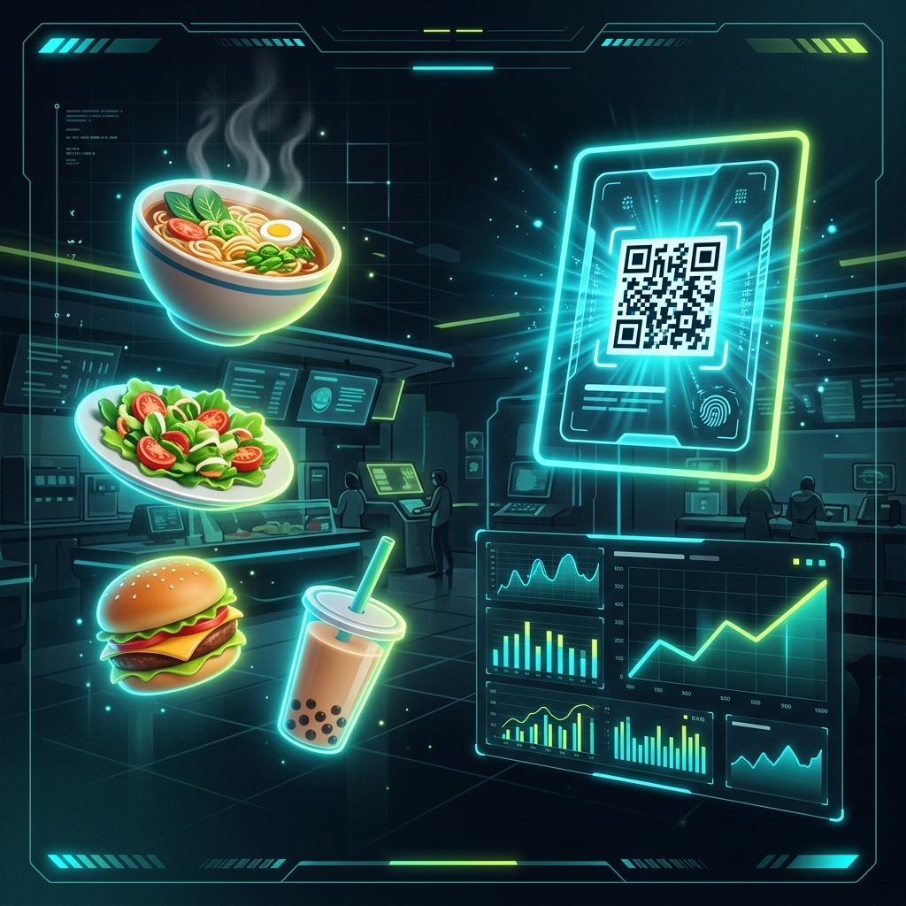
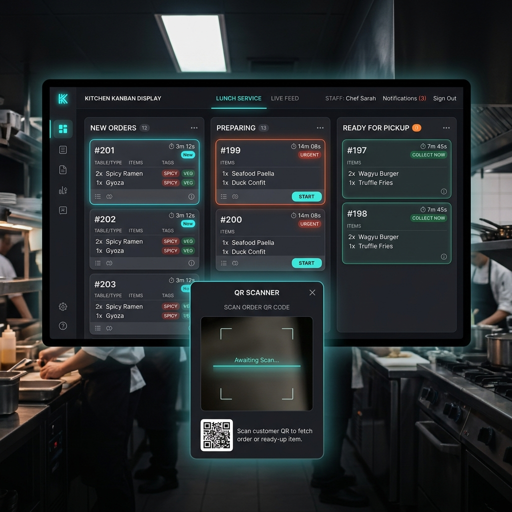
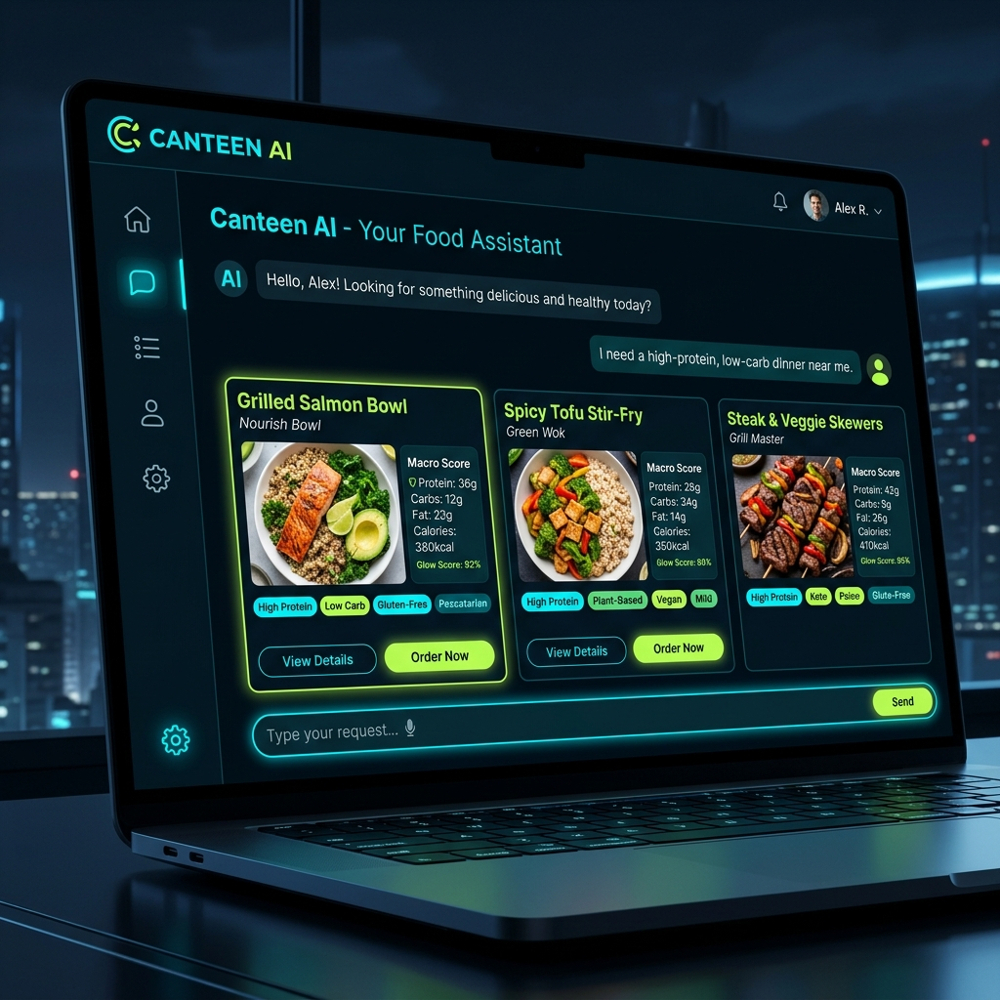
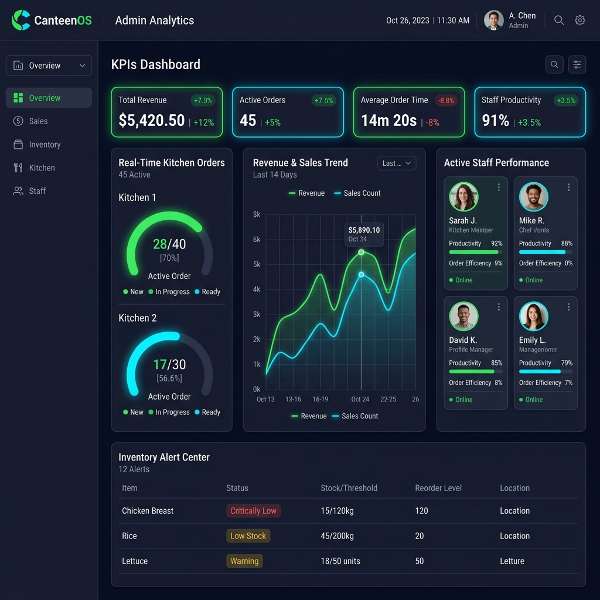
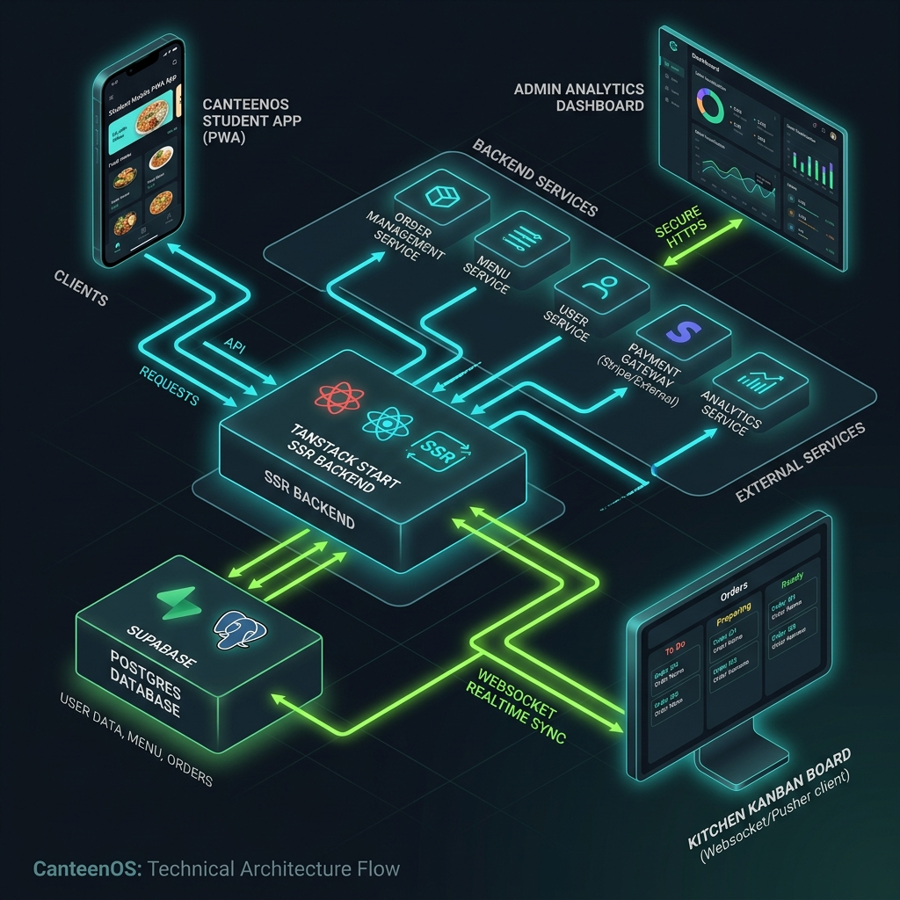
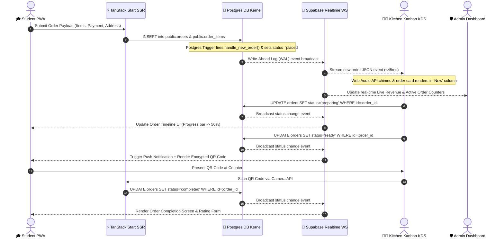
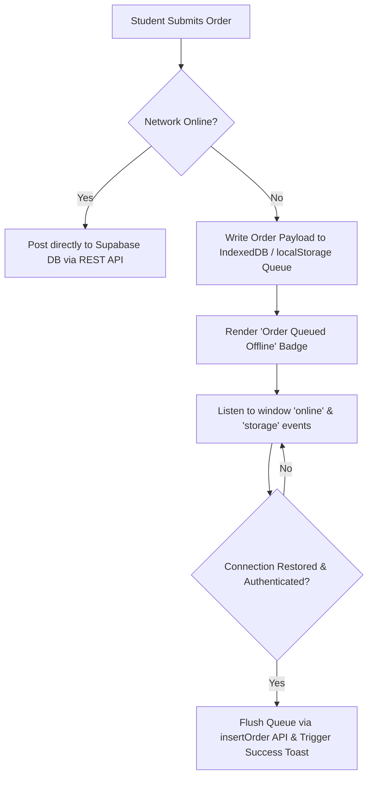

<div align="center">

# ⚡ CANTEENOS KITCHEN HUB ⚡
### *The Ultimate Guide to CanteenOS — Plain-English Primer & Developer Architecture Blueprint*

```text
  ██████╗░█████╗░███╗░░██╗████████╗███████╗███████╗███╗░░██╗██████╗░██████╗
  ██╔════╝██╔══██╗████╗░██║╚══██╔══╝██╔════╝██╔════╝████╗░██║██╔══██╗██╔══██╗
  ██║░░░░░███████║██╔██╗██║░░░██║░░░█████╗░░█████╗░░██╔██╗██║██║░░██║██████╔╝
  ██║░░░░░██╔══██║██║╚████║░░░██║░░░██╔══╝░░██╔══╝░░██║╚████║██║░░██║██╔═══╝░
  ╚██████╗██║░░██║██║░╚███║░░░██║░░░███████╗███████╗██║░╚███║██████╔╝██║░░░░░
  ░╚═════╝╚═╝░░╚═╝╚═╝░░╚══╝░░░╚═╝░░░╚══════╝╚══════╝╚═╝░░╚══╝╚═════╝░╚═╝░░░░░
```

**Order Ahead • Skip the Queue • Real-Time Kitchen Stream • Dynamic QR Pickup • On-Device AI**



[](https://www.typescriptlang.org/)
[](https://react.dev/)
[](https://tanstack.com/start)
[](https://supabase.com/)
[](https://tailwindcss.com/)
[](https://threejs.org/)
[](#-offline-first-pwa-architecture--queue)
[](https://playwright.dev/)
[](LICENSE)

[🌟 Plain-English Overview](#-plain-english-executive-overview) · [👥 User Role Guides](#-quick-start-by-user-role) · [🏗️ System Topology](#-system-topology--event-driven-architecture) · [🗺️ Complete UI Route Map](#-complete-ui-route--feature-map) · [📊 Database ERD](#-database-schema--entity-relationship-diagram-erd) · [🔐 Security & RLS](#-security-architecture--kernel-level-rbac) · [🧠 On-Device AI](#-on-device-canteen-ai-recommendation-engine) · [⚡ Developer Setup](#-developer-setup--getting-started)

</div>

---

## 📋 Master Table of Contents

1. [🌟 Plain-English Executive Overview](#-plain-english-executive-overview)
2. [💡 How CanteenOS Works in 4 Simple Steps](#-how-canteenos-works-in-4-simple-steps)
3. [👥 Quick-Start Guide by User Role](#-quick-start-by-user-role)
4. [🖼️ System Visual Showcase](#-system-visual-showcase)
5. [🗺️ Complete UI Route & Feature Map](#-complete-ui-route--feature-map)
6. [🏗️ System Topology & Event-Driven Architecture](#-system-topology--event-driven-architecture)
7. [👨‍🍳 Real-Time Kitchen Kanban Display System](#-real-time-kitchen-kanban-display-system)
8. [📊 Database Schema & Entity Relationship Diagram (ERD)](#-database-schema--entity-relationship-diagram-erd)
9. [🔐 Security Architecture & Kernel-Level RBAC](#-security-architecture--kernel-level-rbac)
10. [🧠 On-Device Canteen AI Recommendation Engine](#-on-device-canteen-ai-recommendation-engine)
11. [⚡ Low-Level Code Internals & Technical Highlights](#-low-level-code-internals--engineering-highlights)
12. [📁 Complete Directory Blueprint & Codebase Tree](#-complete-directory-blueprint--codebase-tree)
13. [⚙️ Developer Setup & Getting Started](#-developer-setup--getting-started)
14. [🧪 Testing, QA & Load Simulation](#-testing-qa--load-simulation)
15. [🚢 Multi-Cloud Production Deployment](#-multi-cloud-production-deployment)
16. [🛠️ Troubleshooting & FAQ](#-troubleshooting--faq)

---

## 🌟 Plain-English Executive Overview

### What is CanteenOS?
Think of **CanteenOS** as an **all-in-one digital operating system for university cafeterias, office canteens, and food courts**. 

Just like Uber Eats lets you order food on your phone, CanteenOS lets students and staff order meals ahead of time directly on their phones. But unlike public delivery apps, CanteenOS connects **directly to a live touchscreen in the kitchen** and an **executive dashboard in the canteen manager's office**.

### The Problem It Solves
1. ⏰ **No More 20-Minute Lunch Lines**: Students build their cart, pay on their phone, and receive an instant pickup pass with a QR code. They only walk to the counter when their phone alerts them that their meal is cooked and ready.
2. 👨‍🍳 **No More Blind Kitchen Rushes**: Kitchen staff see incoming tickets automatically organized by station (Grill, Beverages, Hot Food) on a real-time Kanban prep board.
3. 📊 **No More Lost Revenue or Food Waste**: Canteen owners get real-time analytics on daily revenue, peak order hours, raw ingredient inventory levels, and staff shifts.

---

## 💡 How CanteenOS Works in 4 Simple Steps

```
┌─────────────────────────┐    ┌─────────────────────────┐    ┌─────────────────────────┐    ┌─────────────────────────┐
│ 1. Student Orders       │    │ 2. Kitchen Cooks        │    │ 3. Instant Notification │    │ 4. QR Pickup Pass       │
│ Browse menu, customize  │ ──►│ Order lands on Kitchen  │ ──►│ Student phone alerts:   │ ──►│ Student scans QR code   │
│ dish, checkout on PWA.  │    │ Kanban board instantly. │    │ "Food is Ready! 🍔"    │    │ at counter and enjoys!  │
└─────────────────────────┘    └─────────────────────────┘    └─────────────────────────┘    └─────────────────────────┘
```

1. 🎓 **Step 1: Student Places Order**: The student opens the CanteenOS PWA on their phone, filters by dietary tags (Veg, Gluten-Free), applies coupons, and places an order.
2. 👨‍🍳 **Step 2: Kitchen Receives Order Instantly**: In `< 45 milliseconds`, the order pops up on the kitchen's Kanban touchscreen. An audio chime plays to alert chefs.
3. 🔔 **Step 3: Real-Time Prep Updates**: As the kitchen moves the ticket from *"Preparing"* to *"Ready for Pickup"*, the student's phone updates automatically without needing to refresh.
4. ⚡ **Step 4: Scan QR Code & Pickup**: The student walks to the counter, shows their animated QR code pass, the staff scans it, and the order is marked completed.

---

## 👥 Quick-Start Guide by User Role

Whether you are a student, a line cook, a canteen owner, or a software engineer, here is how CanteenOS fits your workflow:

### 🎓 1. For Students & Customers
- **Goal**: Order food fast, track prep status, and skip lines.
- **Key Routes**: `/app/menu`, `/app/cart`, `/app/checkout`, `/app/orders/$orderId`, `/app/ai`
- **What You Can Do**:
  - Browse interactive food menus with dietary filters (Vegan, High Protein, Low Calorie).
  - Ask **Canteen AI** for meal suggestions (*"Find me lunch under $8 with high protein"*).
  - Save favorite dishes and earn discount coupons.
  - Track live order status timelines (Placed ➔ Preparing ➔ Ready for Pickup).
  - Show your dynamic QR Code pass at the counter for instant verification.

### 👨‍🍳 2. For Kitchen Staff & Chefs
- **Goal**: Prep orders fast, eliminate order mix-ups, and manage kitchen load.
- **Key Routes**: `/kitchen`, `/kitchen/history`, `/kitchen/menu`
- **What You Can Do**:
  - View incoming orders on a touch-friendly **Kanban Display Board**.
  - Filter tickets by station queue (`Grill`, `Fryer`, `Beverages`, `Bakery`).
  - Drag or click cards to update status (`Preparing` ➔ `Ready`).
  - Listen for Web Audio chime alerts when new orders land during peak rush.
  - Scan student QR codes using your phone/tablet camera to complete orders.

### 🛡️ 3. For Canteen Managers & Executives
- **Goal**: Maximize gross profit, monitor inventory stock, schedule staff, and prevent food waste.
- **Key Routes**: `/admin`, `/admin/analytics`, `/admin/inventory`, `/admin/workforce`, `/admin/reports`
- **What You Can Do**:
  - View real-time gross revenue, order volume, and top-selling dishes.
  - Track raw material inventory levels (stock movements, minimum threshold warnings, purchase orders).
  - Build staff shift rotas and manage attendance logs.
  - Export custom financial & operational reports to CSV or Excel.
  - Manage multi-campus / multi-canteen organization hierarchies.

### 💻 4. For Developers & Engineers
- **Goal**: Understand the codebase, customize features, and run/deploy the system.
- **Tech Stack**: React 19, TypeScript 5.8, TanStack Start, Supabase Postgres/Realtime, Three.js WebGL, Tailwind v4.
- **What You Can Do**:
  - Run the dev server locally with `npm run dev`.
  - Explore file-based routing inside `src/routes/`.
  - Inspect database schemas and Row Level Security (RLS) policies in `supabase/migrations/`.
  - Run Playwright E2E tests using `npm run test:e2e`.

---

## 🖼️ System Visual Showcase

<div align="center">

| 🎓 Student 3D Hub & Ordering Pass | 👨‍🍳 Real-Time Kitchen Kanban KDS |
| :---: | :---: |
|  |  |
| *React Three Fiber 3D hero scene & QR pickup pass* | *Station-filtered preparation board with SLA countdowns* |

| 🤖 On-Device Canteen AI Engine | 🛡️ Executive Admin Command Center |
| :---: | :---: |
|  |  |
| *Temporal window scoring & macro nutritional calculator* | *Real-time financial charts, stock movement & health monitors* |

</div>

---

## 🗺️ Complete UI Route & Feature Map

Here is an explicit map of every page and route built inside CanteenOS:

### 🎓 Student Application (`/app`)
- **`/`**: Marketing Landing Page with interactive 3D WebGL food showcase and features overview.
- **`/app`**: Student Dashboard — Quick re-order carousel, temporal meal recommendation banner, active order tracker pill.
- **`/app/menu`**: Full Food Menu Explorer — Category tabs, real-time search bar, dietary filter toggles (Veg/Non-Veg, Vegan, Calories), sorting by price & popularity.
- **`/app/menu/$itemId`**: Dish Detail Screen — Calorie macros, preparation time estimate, special cooking notes, and quantity selector.
- **`/app/cart`**: Shopping Cart Drawer & Page — Line item adjustments, coupon promo code redemption box, packaging fees calculation.
- **`/app/checkout`**: Checkout Flow — Pickup vs. Delivery selector, campus canteen location picker, payment method selector (Wallet, Card, UPI, Cash).
- **`/app/orders`**: Order History Hub — View active orders, past order receipts, re-order button.
- **`/app/orders/$orderId`**: Order Tracking Timeline — Real-time progress bar (Placed ➔ Preparing ➔ Ready ➔ Completed), estimated ready timer, and animated **QR Pickup Pass**.
- **`/app/favorites`**: Bookmarked Dishes Library.
- **`/app/profile`**: Student Profile Hub — Student ID, department info, address book, wallet balance.
- **`/app/ai`**: **Canteen AI Assistant** — Conversational meal finder, macro calorie advice, dietary recommendations.
- **`/app/notifications`**: In-App Notification Center — Ready-for-pickup alerts and promotional announcements.
- **`/app/settings`**: Preferences — Dark/Light theme, Motion Preference, GPU Performance Tier override.

### 👨‍🍳 Kitchen Workspace (`/kitchen`)
- **`/kitchen`**: **Kitchen Display System (KDS)** — Kanban columns (`New Orders`, `Preparing`, `Ready for Pickup`), station filters, SLA countdown timers, Web Audio chime alerts, QR camera scanner popup.
- **`/kitchen/history`**: Completed Ticket History — Filter by date, search past order receipts, inspect preparation duration SLAs.
- **`/kitchen/menu`**: Instant Menu Availability Toggles — Quickly toggle items "Out of Stock" or "Available" during busy shifts.
- **`/kitchen/notifications`**: Kitchen Staff Alert Board.

### 🛡️ Admin Management Suite (`/admin`)
- **`/admin`**: Executive Overview — Real-time revenue stat cards, active order counter, sales trend graphs, recent order list.
- **`/admin/analytics`**: Deep Analytics Hub — Sales breakdown, revenue projections, order volume heatmaps, top-selling items.
- **`/admin/menu`**: Menu Management — Add/edit dishes, upload food images, set pricing, assign tags & prep times.
- **`/admin/categories`**: Menu Category Manager — Sort orders, custom emojis, color tints, visibility toggles.
- **`/admin/coupons`**: Discount Engine — Create promo codes, set percentage/flat discounts, usage limits, expiration dates.
- **`/admin/inventory`**: Stock Control & Operations — Item SKU ledger, current stock levels, low-stock threshold alerts, supplier directory, purchase order logger.
- **`/admin/customers`**: Customer CRM — Student order frequency, total spend, loyalty status.
- **`/admin/staff`**: Staff Roster — Kitchen employee list, assigned roles, shift performance.
- **`/admin/users`**: User Management — Full account lookup, account status controls, email verification status.
- **`/admin/roles`**: Role-Based Access Control (RBAC) — Assign `student`, `kitchen`, or `admin` roles to user accounts.
- **`/admin/approvals`**: Workflow Approval Engine — Multi-step managerial approvals for high-value purchase orders or inventory adjustments.
- **`/admin/workforce`**: Rota Scheduling — Shift templates, weekly employee shift assignments, attendance logs.
- **`/admin/organization`**: Enterprise Multi-Tenant Hierarchy — Multi-campus manager, branch canteen switcher, organization settings.
- **`/admin/reports`**: Reports Library — Download CSV / Excel reports for financial auditing, inventory usage, and tax summaries.
- **`/admin/audit`**: System Audit Log — Immutable event ledger tracking all admin actions, role changes, and inventory edits.
- **`/admin/activity`**: Live Activity Stream — Real-time event log of platform usage.
- **`/admin/notifications`**: Broadcast Broadcaster — Send instant banner announcements to all active student apps.
- **`/admin/monitoring`**: Infrastructure Status — Real-time Web Vitals, database connection health, API latency metrics.
- **`/admin/settings`**: Canteen Workspace Configuration — Tax rates, packaging fees, operating hours, currency formatting.
- **`/admin/qa`**: Testing & Simulation Harness — Traffic burst generator, offline network flakiness tester, audio chime tester.

---

## 🏗️ System Topology & Event-Driven Architecture

CanteenOS utilizes a decoupled, event-driven topology combining **TanStack Start** SSR at the edge with **Supabase Enterprise Postgres** and **WebSocket Realtime CDC** at the backend layer.



```
                                  +---------------------------------------+
                                  |         Client Layer (Browser/PWA)    |
                                  +-------------------+-------------------+
                                                      |
                                    HTTP/2 SSR / JSON | WebSocket CDC Stream
                                                      v
                                  +-------------------+-------------------+
                                  |    TanStack Start Edge Runtime        |
                                  |   (Nitro Engine / Server Functions)   |
                                  +-------------------+-------------------+
                                                      |
                                                      | Supabase Client SDK
                                                      v
                                  +-------------------+-------------------+
                                  |   Supabase Postgres Database Kernel   |
                                  |  - Row Level Security (RLS) Policies  |
                                  |  - SECURITY DEFINER Functions         |
                                  |  - WAL Change Data Capture (CDC)      |
                                  +-------------------+-------------------+
                                                      |
                                                      | Realtime Broadcast
                                                      v
                                  +-------------------+-------------------+
                                  |   Kitchen KDS & Admin WebSockets      |
                                  +---------------------------------------+
```

---

### Real-Time WebSocket Order Stream (Sequence Flow)



---

## 👨‍🍳 Real-Time Kitchen Kanban Display System

The Kitchen Display System (KDS) is designed for touchscreens, tablets, and wall-mounted kitchen monitors. It transforms incoming raw DB events into a prioritized preparation stream.


### Key Capabilities:
1. **Zero-Polling WebSocket Stream**: Incoming tickets render in `< 45ms` without page reloads.
2. **Station Queue Filtering**: Instantly isolate tickets by station (`Hot Kitchen`, `Grill`, `Beverages`, `Bakery & Desserts`).
3. **SLA Countdown Timer**: Visual color coding alerts kitchen staff to impending prep delays:
   - 🟢 `0 - 8 mins`: Normal Prep Window
   - 🟡 `9 - 14 mins`: SLA Warning Threshold
   - 🔴 `15+ mins`: SLA Breach Alert
4. **Web Audio Synthesizer**: Plays distinct audio chiming frequencies on ticket events via the Web Audio API without fetching external MP3 files.
5. **Integrated QR Pickup Scanner**: Built-in camera scanner validates student pickup codes in real time to prevent stolen or duplicate claims.

---

## 📊 Database Schema & Entity Relationship Diagram (ERD)

CanteenOS operates on a fully normalized PostgreSQL schema with 100% Row Level Security (RLS) enforcement.


---

## 🔐 Security Architecture & Kernel-Level RBAC

Security is enforced at the database engine level using PostgreSQL **Row Level Security (RLS)** and **SECURITY DEFINER** policies. Even if a client bypasses UI checks, database queries executed without valid JWT claims are rejected by Postgres.

### Security Definer Core Kernel Functions (`supabase/migrations/`):

```sql
-- Checks if a specific user possesses a specific app role
CREATE OR REPLACE FUNCTION public.has_role(_user_id uuid, _role public.app_role)
RETURNS boolean LANGUAGE sql STABLE SECURITY DEFINER SET search_path = public AS $$
  SELECT EXISTS (
    SELECT 1 FROM public.user_roles 
    WHERE user_id = _user_id AND role = _role
  );
$$;

-- Checks if a user belongs to staff (kitchen or admin)
CREATE OR REPLACE FUNCTION public.is_staff(_user_id uuid)
RETURNS boolean LANGUAGE sql STABLE SECURITY DEFINER SET search_path = public AS $$
  SELECT EXISTS (
    SELECT 1 FROM public.user_roles 
    WHERE user_id = _user_id AND role IN ('kitchen', 'admin')
  );
$$;
```

---

## 🧠 On-Device Canteen AI Recommendation Engine

Located at `src/lib/canteen-ai.ts`, **Canteen AI** is a zero-latency, deterministic recommendation engine running directly on the client. It synthesizes menu catalogues, user order history, category affinity scores, and temporal meal windows without requiring external API tokens or network latency.

```typescript
export function recommendFor(
  items: MenuItem[],
  orders: Order[],
  opts: { favorites?: string[]; limit?: number; vegOnly?: boolean } = {},
): AiSuggestion[] {
  const { limit = 6, vegOnly = false } = opts;
  const window = mealWindow(); // Returns 'breakfast' | 'lunch' | 'snacks' | 'dinner'
  const windowTagsList = windowTags[window];

  const catAffinity = new Map<string, number>();
  orders.forEach((o) =>
    o.lines.forEach((l) => {
      const item = items.find((i) => i.id === l.itemId);
      if (item) {
        catAffinity.set(item.categorySlug, (catAffinity.get(item.categorySlug) ?? 0) + l.qty);
      }
    }),
  );

  return items
    .filter((i) => i.available && (!vegOnly || i.veg))
    .map((item) => {
      let score = item.popularity * 0.4 + item.rating * 8;
      
      // Category Affinity Boost
      const affinity = catAffinity.get(item.categorySlug) ?? 0;
      if (affinity > 0) score += Math.min(affinity * 15, 60);

      // Time-of-day Matching Tag Boost
      const matchesWindow = item.tags.some((t) => windowTagsList.includes(t.toLowerCase()));
      if (matchesWindow) score += 25;

      return { item, reason: `Matches your ${window} preference`, score };
    })
    .sort((a, b) => b.score - a.score)
    .slice(0, limit);
}
```

---

## ⚡ Low-Level Code Internals & Technical Highlights

### 1. Dynamic Hardware GPU Capability Tiering (`src/hooks/use-perf-tier.ts`)

To ensure smooth 60 FPS 3D rendering on budget mobile phones while unlocking high-fidelity depth-of-field shaders on desktop GPUs:

```typescript
export type PerfTier = "high" | "medium" | "low";

function detectTier(): PerfTier {
  if (typeof window === "undefined") return "medium";

  const nav = navigator as Navigator & { deviceMemory?: number };
  const cores = nav.hardwareConcurrency ?? 4;
  const memory = nav.deviceMemory ?? 4;
  const coarse = window.matchMedia?.("(pointer: coarse)").matches;
  const narrow = window.innerWidth < 768;

  if (cores <= 4 || memory <= 4 || (coarse && narrow)) return "low";
  if (cores <= 8 || memory <= 8) return "medium";
  return "high";
}
```

### 2. PWA Offline Storage-Synced Order Queue (`src/hooks/use-offline-queue.ts`)



---

## 📁 Complete Directory Blueprint & Codebase Tree

```text
canteenos-kitchen-hub/
├── .github/                      # GitHub Workflows & CI/CD deployment actions
├── docs/                         # Screenshots & architecture visual graphics
│   └── images/                   # High-res PNG mockups and topology graphics
│       ├── hero-banner.png       # 3D Student App Hero & QR Pass visual
│       ├── system-architecture.png # Isometric microservices topology diagram
│       ├── kitchen-kanban.png    # Kitchen Display Board (KDS) mockup
│       ├── canteen-ai.png        # Canteen AI recommendation UI screenshot
│       └── admin-analytics.png   # Admin command dashboard & financial charts
├── public/                       # Static public assets served at site root
│   ├── manifest.webmanifest     # Progressive Web App manifest
│   ├── robots.txt               # Search engine crawler permissions
│   └── icon-*.png               # PWA maskable & standard app icons
├── src/                          # Application source code
│   ├── components/               # Modular React 19 UI components
│   │   ├── ai/                   # Canteen AI widget & chat components
│   │   ├── auth/                 # Auth protection gates & role guards
│   │   ├── fx/                   # Aurora backgrounds, 3D tilt cards & glassmorphism
│   │   ├── landing/              # Marketing sections & 3D food showcases
│   │   ├── layout/               # App Shell, sidebar, mobile bottom navigation
│   │   ├── pwa/                  # Offline notification banner & sync queue status
│   │   ├── search/               # Command Palette (⌘K) global search modal
│   │   ├── shared/               # Reusable DataTables, StatCards, Recharts wrappers
│   │   ├── three/                # React Three Fiber 3D WebGL Canvas components
│   │   └── ui/                   # Headless Radix UI + shadcn primitive components
│   ├── contexts/                 # React Context Providers (Cart, Audio, Theme)
│   ├── data/                     # Seed datasets & offline mock fallbacks
│   ├── hooks/                    # Custom React hooks
│   ├── integrations/             # Third-party SDK clients
│   ├── lib/                      # Core domain business logic
│   ├── routes/                   # TanStack Start file-based routing tree
│   ├── types/                    # Domain-wide TypeScript type definitions
│   ├── router.tsx                # TanStack Router & Query Client configuration
│   ├── server.ts                 # Nitro SSR entry point & security headers
│   └── styles.css                # Tailwind CSS v4 custom theme tokens & keyframes
├── supabase/                     # Supabase backend engine workspace
│   └── migrations/               # SQL migrations (Tables, RLS, Security Definers)
├── tests/                        # Playwright E2E automation test suites
├── DEPLOYMENT.md                 # Multi-cloud deployment guide
├── netlify.toml                  # Netlify deployment configuration
├── package.json                  # Dependencies & execution scripts
├── playwright.config.ts          # Playwright test harness settings
├── tsconfig.json                 # TypeScript strict compiler config
├── vercel.json                   # Vercel deployment configuration
└── vite.config.ts                # Vite bundler, PWA plugin & Nitro settings
```

---

## ⚙️ Developer Setup & Getting Started

### Prerequisites
- **Node.js**: `v20.0.0` or higher
- **Package Manager**: `npm` (v10+), `bun` (v1.1+), or `pnpm` (v9+)
- **Git**: `v2.40+`

---

### Step-by-Step Local Setup

1. **Clone the Repository**:
   ```bash
   git clone https://github.com/Ranjitpatra26/canteenos-hub.git
   cd canteenos-kitchen-hub
   ```

2. **Install Dependencies**:
   ```bash
   npm install
   ```

3. **Configure Environment Variables**:
   Copy `.env.example` to create `.env`:
   ```bash
   cp .env.example .env
   ```

4. **Launch Development Server**:
   ```bash
   npm run dev
   ```
   Navigate to **`http://localhost:3000`**.

---

## 🧪 Testing, QA & Load Simulation

```bash
# Run headless E2E Playwright tests
npm run test:e2e

# Launch interactive Playwright test runner UI
npm run test:e2e:ui
```

---

## 🚢 Multi-Cloud Production Deployment

```bash
# Build for Vercel Serverless
npm run build:vercel

# Build for Netlify Edge Functions
npm run build:netlify

# Standard Node.js Container Build
npm run build
node .output/server/index.mjs
```

---

## 📜 License & Credits

Built with ❤️ by **DeepMind Advanced Agentic Coding Team** & **Ranjit Patra**.

Licensed under the **MIT License** — see the [LICENSE](LICENSE) file for details.

<div align="center">

**[⬆ Back to Top](#-canteenos-kitchen-hub-)**

</div>
