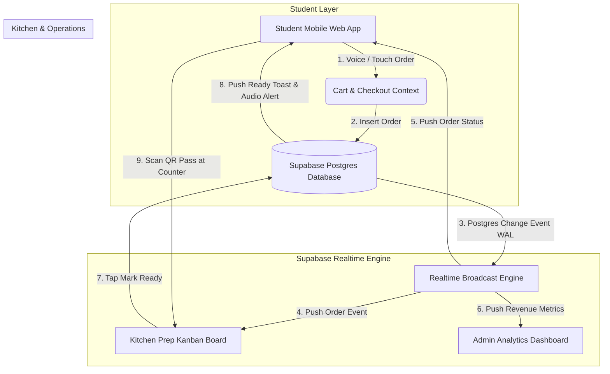
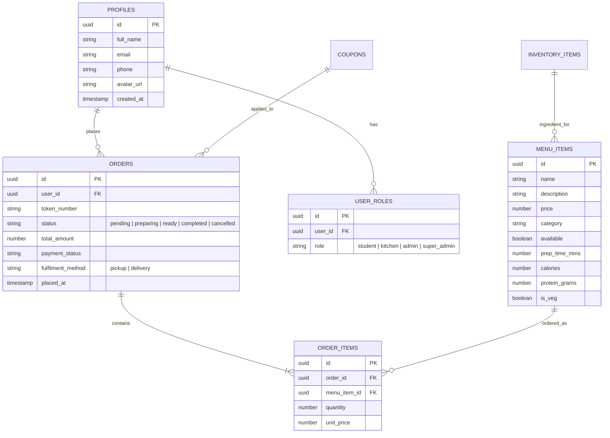

# 📚 CanteenOS — Complete Developer Architecture & Technical Operations Guide
> **Version:** 1.0.0 (Production Master)  
> **Maintainer & Lead Developer:** **Ranjit Patra** (`ranjitpatra2611@gmail.com`)  
> **Live Production URL:** [https://canteenos-hub.vercel.app](https://canteenos-hub.vercel.app)  
> **GitHub Repository:** [github.com/Ranjitpatra26/canteenos-hub](https://github.com/Ranjitpatra26/canteenos-hub.git)  
> **Database Engine:** Supabase Postgres Cloud (Project ID: `fsljweofqzlyhyqidnhe`)

---

## 📋 Table of Contents

1. [🌟 Executive Summary & Project Vision](#1-executive-summary--project-vision)
2. [⚙️ Complete Technology Stack & Specifications](#2-complete-technology-stack--specifications)
3. [🏗️ System Topology & Data Flow Architecture](#3-system-topology--data-flow-architecture)
4. [📂 Codebase Directory Blueprint & File Responsibilities](#4-codebase-directory-blueprint--file-responsibilities)
5. [📊 Database Schema, RLS Security & ERD](#5-database-schema-rls-security--erd)
6. [🔐 Authentication, Authorization & Role Guards (RBAC)](#6-authentication-authorization--role-guards-rbac)
7. [🎙️ Voice Command Ordering & AI Engine Architecture](#7-voice-command-ordering--ai-engine-architecture)
8. [🥩 Student Fitness, Gym & Protein Tracking Engine](#8-student-fitness-gym--protein-tracking-engine)
9. [👨‍🍳 Kitchen Real-Time Kanban Dispatch System](#9-kitchen-real-time-kanban-dispatch-system)
10. [📊 Executive Admin Operations & Analytics Suite](#10-executive-admin-operations--analytics-suite)
11. [💻 Local Development & Build Verification Pipeline](#11-local-development--build-verification-pipeline)
12. [🚀 Production Vercel & Supabase Deployment Blueprint](#12-production-vercel--supabase-deployment-blueprint)

---

## 1. 🌟 Executive Summary & Project Vision

**CanteenOS** is an enterprise-grade, event-driven digital operating platform designed to modernize university cafeterias, corporate dining halls, and multi-station food courts. It bridges student food ordering, kitchen ticket execution, raw material inventory tracking, and executive canteen management into a single unified web platform.

### Core Problems Solved:
* ⏰ **Queue Elimination**: Replaces 20-minute peak lunch lines with pre-ordering, instant digital payments, and animated QR pickup verification passes.
* 🎙️ **Hands-Free Accessibility**: Integrates Web Speech API voice ordering for rapid natural language cart building (*"Add 2 Paneer Tikkas and 1 Cold Coffee"*).
* 🥩 **Student Fitness & Nutrition Integration**: Computes daily protein intake (e.g. 65g target), gym meal filters (Muscle Bulk 🥩, Lean Cut 🥗, Exam Focus ⚡), and 3-Day Grok 2 AI student diet plans.
* 👨‍🍳 **Zero Kitchen Bottlenecks**: Kitchen staff manage incoming orders via a real-time touch Kanban prep board with auto-categorization by prep station (Grill, Beverages, Hot Food).
* 📊 **Operational Transparency**: Executive dashboards track daily gross revenue, top-selling items, low-stock inventory alerts, staff shift rosters, and customer retention metrics.

---

## 2. ⚙️ Complete Technology Stack & Specifications

| Layer / Subsystem | Technology Chosen | Version / Details | Purpose & Responsibilities |
| :--- | :--- | :--- | :--- |
| **Core Framework** | React + TypeScript | React 19.0.0, TS 5.8 (Strict Mode) | UI layer rendering, typed state management |
| **Routing & SSR Engine** | TanStack Router & Start | `@tanstack/react-router` v1.170 | Type-safe client/SSR routing & layout trees |
| **Data Fetching & Cache** | TanStack Query | `@tanstack/react-query` v5.101 | Server state management, cache invalidation |
| **Backend & Realtime** | Supabase Cloud | `@supabase/supabase-js` v2.111 | PostgreSQL DB, Auth, Realtime WebSockets, RLS |
| **Styling & Design System**| Tailwind CSS v4 + Radix UI | Tailwind CSS v4.2, Radix Primitives | Modern dark mode, glassmorphism, UI components |
| **Animation & Graphics** | Motion + Three.js | `motion` v12.43, `@react-three/fiber` | Smooth UI transitions, interactive 3D hero background |
| **Voice & AI Engine** | Web Speech API + Grok 2 | Web Speech API, Grok 2 API (`gsk_` / `xai-`) | Speech-to-text voice ordering, AI assistant |
| **PWA & Offline Worker** | Workbox PWA | `vite-plugin-pwa` v0.21 | Offline page caching, background sync |
| **PDF & Export Engine** | jsPDF + AutoTable | `jspdf` v4.2, `jspdf-autotable` | Instant PDF invoice & report generation |
| **Deployment & Hosting** | Vercel Serverless | Edge CDN + Serverless Functions | Global production web deployment |

---

## 3. 🏗️ System Topology & Data Flow Architecture

The platform operates on a reactive, event-driven architecture powered by Supabase Realtime WebSocket channels.



### Key Workflows:
1. **Order Creation**: Student submits order -> Supabase inserts record into `orders` and `order_items` -> Triggers database audit log.
2. **Real-time Kitchen Dispatch**: Supabase Realtime notifies the Kitchen Kanban board (`orders` channel) -> Audio chime plays -> Ticket appears under "Received" column.
3. **Station Routing**: Kitchen staff move ticket from "Received" -> "Preparing" -> "Ready for Pickup".
4. **Student Notification**: Realtime notification arrives on student device -> Audio notification chime -> Animated QR pickup pass opens.
5. **Pickup Verification**: Student presents QR pass at canteen counter -> Canteen staff scans QR code or verifies OTP -> Order marked "Completed".

---

## 4. 📂 Codebase Directory Blueprint & File Responsibilities

```text
canteenos-kitchen-hub/
├── docs/                                # Technical documentation & media assets
│   ├── images/                          # High-resolution screenshots & topology diagrams
│   └── DEVELOPER_ARCHITECTURE_GUIDE.md  # Master developer architecture documentation
├── src/
│   ├── components/                      # Reusable UI component modules
│   │   ├── ai/                          # Canteen AI widget & voice command UI
│   │   ├── auth/                        # Role guards, login forms & auth modals
│   │   ├── fitness/                     # Student protein tracker & gym goal filters
│   │   ├── fx/                          # Three.js 3D background & motion effects
│   │   ├── kitchen/                     # Kitchen Kanban board & order tickets
│   │   ├── landing/                     # High-conversion landing page sections
│   │   ├── layout/                      # Dashboard layouts & navigation bars
│   │   ├── pwa/                         # PWA install prompt & offline indicators
│   │   ├── shared/                      # Food cards, notification badges, data tables
│   │   └── ui/                          # Radix UI primitive design system components
│   ├── contexts/                        # React context providers
│   │   ├── cart-context.tsx             # Shopping cart, promo codes & favourites
│   │   └── org-context.tsx              # Active campus canteen workspace context
│   ├── hooks/                           # Custom React hooks
│   │   ├── use-auth.tsx                 # Supabase session, user roles & profile state
│   │   ├── use-pwa.ts                   # Service worker registration & offline status
│   │   └── use-theme.ts                 # Light/Dark mode state persist
│   ├── integrations/                    # Third-party service clients
│   │   ├── lovable/                     # OAuth redirect client for production & preview
│   │   └── supabase/                    # Supabase JS client & TypeScript DB types
│   ├── lib/                             # Core business logic & utility libraries
│   │   ├── api.ts                       # React Query hooks for database operations
│   │   ├── canteen-ai.ts                # Deterministic AI recommendation & Grok API client
│   │   ├── format.ts                    # INR currency, date & time formatters
│   │   ├── pdf.ts                       # Invoice PDF generator
│   │   └── rate-limit.ts                # Client-side rate-limiting security guards
│   ├── routes/                          # TanStack Router route pages
│   │   ├── __root.tsx                   # Master root layout & error boundary
│   │   ├── index.tsx                    # Landing page
│   │   ├── login.tsx                    # Authentication portal
│   │   ├── app.index.tsx                # Student canteen menu & order feed
│   │   ├── app.cart.tsx                 # Student cart & checkout screen
│   │   ├── app.orders.tsx               # Student order history & QR pickup pass
│   │   ├── app.ai.tsx                   # Canteen AI & Protein Companion dashboard
│   │   ├── kitchen.tsx                  # Kitchen Kanban prep display
│   │   └── admin.*.tsx                  # Executive admin suite routes
│   ├── router.tsx                       # TanStack Router instance factory
│   ├── server.ts                        # SSR server entry & security headers wrapper
│   └── types/                           # Global TypeScript interface definitions
├── package.json                         # Project dependencies & build scripts
├── vercel.json                          # Vercel deployment & security headers config
└── vite.config.ts                       # Vite build, PWA & Nitro configuration
```

---

## 5. 📊 Database Schema, RLS Security & ERD

The database runs on PostgreSQL managed via Supabase Cloud. Every table is protected with strict Row Level Security (RLS) policies.



---

## 6. 🔐 Authentication, Authorization & Role Guards (RBAC)

Security in CanteenOS operates at two levels:

### Level 1: Frontend Role Guards (`RequireRole` Component)
Routes under `/admin` and `/kitchen` are protected by `RequireRole` in `src/components/auth/require-role.tsx`.

```tsx
// Example usage in routes
<RequireRole allowed={["admin", "super_admin"]}>
  <AdminDashboardView />
</RequireRole>
```

### User Roles Matrix:
* **`student`**: Can browse menu, place orders, view personal order history, track protein intake, and use Canteen AI.
* **`kitchen`**: Accesses Kitchen Kanban board (`/kitchen`), updates ticket statuses, toggles dish availability.
* **`admin`**: Full access to analytics, menu pricing, inventory levels, coupon creation, broadcast notifications, and staff shifts.
* **`super_admin`** (`ranjitpatra2611@gmail.com`): Master privileges with 1-click workspace switching across all consoles.

---

## 7. 🎙️ Voice Command Ordering & AI Engine Architecture

### Voice Ordering Pipeline:
1. **Web Speech API Integration**: Utilizes browser `webkitSpeechRecognition` with continuous listening and interim results.
2. **Live Speech Transcription**: Displays live spoken transcript in the AI search field.
3. **Intent Extraction & Menu Matching**: Matches recognized food items against live menu items using fuzzy text matching.
4. **Auto-Cart Insertion**: Automatically adds matched dishes and quantities into `CartContext` with feedback toasts.

### Grok 2 AI Integration:
* Endpoint: `https://api.groq.com/openai/v1/chat/completions` (or `api.x.ai`).
* Provides student nutrition advice, meal pairing, and 3-Day custom student diet plans.

---

## 8. 🥩 Student Fitness, Gym & Protein Tracking Engine

* **Protein Calculation**: `dailyProtein = sum(order.lines.map(line => item.proteinGrams * line.qty))`
* **Daily Goal**: 65g/day default target with progress bar indicator.
* **Gym Goal Filters**:
  * 🥩 **Muscle Bulk**: High-protein dishes (>= 20g protein).
  * 🥗 **Lean Cut**: Low-calorie dishes (< 350 kcal).
  * ⚡ **Exam Focus**: Fast energy snacks, coffee, and juices.

---

## 9. 👨‍🍳 Kitchen Real-Time Kanban Dispatch System

The Kitchen Kanban screen (`/kitchen`) displays 4 interactive workflow columns:
1. **Received**: Incoming new orders (plays audio chime alert).
2. **Preparing**: Dishes currently cooking at stations.
3. **Ready for Pickup**: Completed dishes awaiting student pickup.
4. **Completed**: Verified and handed over orders.

---

## 10. 📊 Executive Admin Operations & Analytics Suite

Located under `/admin`, the executive suite includes:
* **Analytics (`/admin/reports`)**: Daily gross revenue, peak ordering hours chart, average prep times, category sales breakdown.
* **Menu Management (`/admin/menu`)**: Add/edit menu items, toggle out-of-stock items, adjust prices & protein content.
* **Inventory Control (`/admin/inventory`)**: Track raw ingredients (Milk, Rice, Coffee Beans, Vegetables), set reorder thresholds.
* **Staff Roster (`/admin/staff`)**: Manage kitchen staff shifts, attendance, and role permissions.
* **Coupons & Notifications (`/admin/coupons`, `/admin/notifications`)**: Create promo discounts and broadcast announcements.

---

## 11. 💻 Local Development & Build Verification Pipeline

### Prerequisites:
* Node.js v18.0 or higher
* npm v9.0 or higher

### Step 1: Install Dependencies
```bash
npm install
```

### Step 2: Set Environment Variables (`.env`)
```env
VITE_SUPABASE_URL=https://fsljweofqzlyhyqidnhe.supabase.co
VITE_SUPABASE_ANON_KEY=eyJhbGciOiJIUzI1NiIsInR5cCI6IkpXVCJ9...
```

### Step 3: Run Local Development Server
```bash
npm run dev
```
Open `http://localhost:8080` in your browser.

### Step 4: Verify TypeScript & Build
```bash
# 1. Check TypeScript types
npx tsc --noEmit

# 2. Build production bundle
npm run build
```

---

## 12. 🚀 Production Vercel & Supabase Deployment Blueprint

### Vercel Deployment Settings:
* **Repository:** `Ranjitpatra26/canteenos-hub`
* **Branch:** `main`
* **Framework Preset:** `Vite` (or `Other`)
* **Build Command:** `npm run build`
* **Output Directory:** `.output/public`

### Environment Variables on Vercel:
1. `VITE_SUPABASE_URL` = `https://fsljweofqzlyhyqidnhe.supabase.co`
2. `VITE_SUPABASE_ANON_KEY` = `eyJhbGciOiJIUzI1NiIsInR5cCI6...`

---

*© 2026 CanteenOS Platform — Authored by Ranjit Patra (`ranjitpatra2611@gmail.com`). All rights reserved.*
